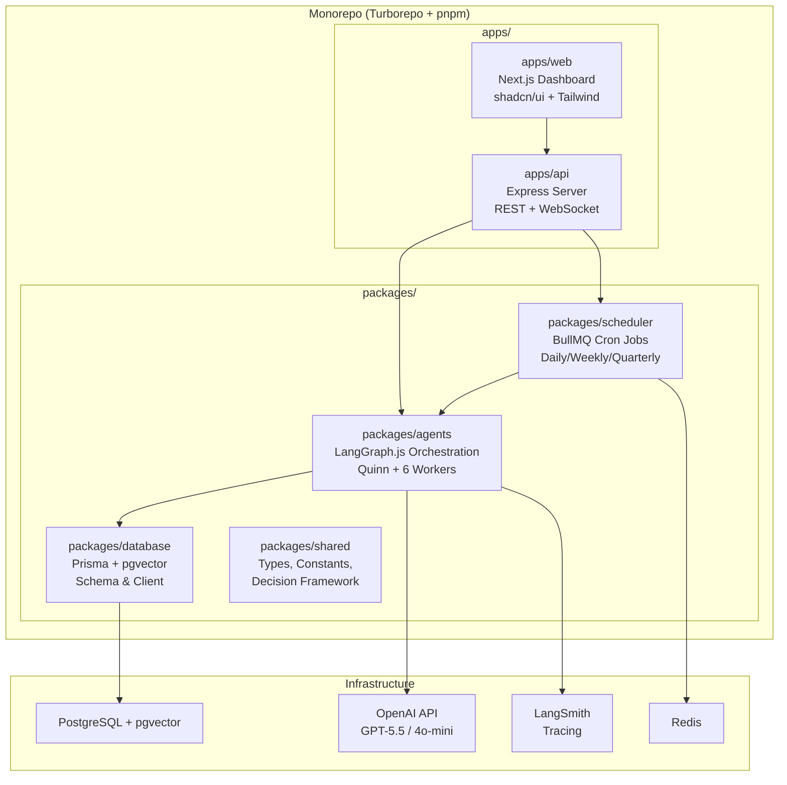
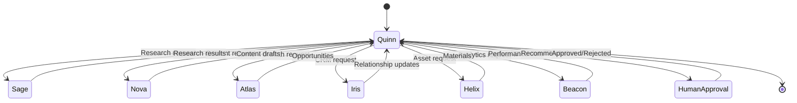

# Quinn — AI Chief Marketing Officer for Dermaqea

Build an autonomous, multi-agent AI marketing executive system that proactively researches, plans, drafts, analyzes, and recommends actions to grow Dermaqea, requiring human approval before any external execution.

---

## User Review Required

> [!IMPORTANT]
> **GPT-5.5 vs GPT-4o for strategic reasoning**: GPT-5.5 is available ($5/$30 per 1M tokens). However, GPT-4o ($2.50/$10) is significantly cheaper and may be sufficient for most agent reasoning tasks. I recommend using GPT-5.5 **only for Quinn (CMO)** strategic decisions and GPT-4o-mini for worker agents' repetitive classification/summarization. Please confirm your preference and budget expectations.

> [!IMPORTANT]
> **Infrastructure requirements**: This system requires running PostgreSQL, Redis, and the Next.js dashboard. Are you planning to deploy via Docker Compose locally, or do you have cloud infrastructure (Vercel, Railway, etc.) in mind? This affects how we structure the deployment configuration.

> [!WARNING]
> **API Keys Required Before First Run**: You will need:
> - `OPENAI_API_KEY` — for GPT-5.5 / GPT-4o-mini
> - `LANGSMITH_API_KEY` — for tracing (optional but recommended)
> - `DATABASE_URL` — PostgreSQL connection string
> - `REDIS_URL` — Redis connection string

---

## Open Questions

1. **Content publishing integrations**: Should Quinn eventually integrate with real LinkedIn/Twitter APIs for publishing, or is the V1 purely a "draft and approve" workflow with manual human publishing?
2. **Email sending**: Do you have a preferred email service (Resend, SendGrid, etc.) for outreach campaigns, or should V1 just generate email drafts?
3. **Web scraping for Sage**: Should Sage actively scrape company websites for research, or rely on LLM knowledge + structured web search APIs (Tavily, SerpAPI)?
4. **Authentication**: Should the dashboard have user auth (NextAuth/Clerk), or is this a single-founder tool for now?
5. **Data seeding**: Do you have any existing research, contacts, or company profiles you'd like to seed into Quinn's memory at launch?

---

## Architecture Overview



---

## Proposed Changes

### Phase 1: Monorepo Foundation

#### [NEW] Root Configuration

Set up Turborepo monorepo with pnpm workspaces.

**Files:**
- `package.json` — Root workspace config
- `pnpm-workspace.yaml` — Workspace definitions
- `turbo.json` — Task pipeline (build, dev, lint, test)
- `tsconfig.base.json` — Shared TypeScript config
- `.env.example` — Required environment variables
- `docker-compose.yml` — PostgreSQL + Redis for local dev

**Structure:**
```
quinn/
├── apps/
│   ├── web/              # Next.js dashboard
│   └── api/              # Express API server
├── packages/
│   ├── agents/           # LangGraph agent system
│   ├── database/         # Prisma schema + client
│   ├── shared/           # Types, enums, utilities
│   └── scheduler/        # BullMQ job scheduling
├── docker-compose.yml
├── turbo.json
├── pnpm-workspace.yaml
└── tsconfig.base.json
```

---

### Phase 2: Database Layer (`packages/database`)

#### [NEW] Prisma Schema & Migrations

Design the complete data model for Quinn's persistent memory.

**Core Models:**

| Model | Purpose |
|---|---|
| `Organization` | Companies researched by Sage (profiles, scores, contacts) |
| `Contact` | Individual decision-makers and their information |
| `Relationship` | CRM state managed by Iris (stage, follow-ups, interactions) |
| `ContentItem` | All content generated by Nova (posts, articles, etc.) |
| `ContentCalendar` | Monthly content scheduling |
| `Opportunity` | Growth opportunities tracked by Atlas |
| `Campaign` | Marketing campaigns and their performance |
| `Approval` | Human approval queue (pending/approved/rejected) |
| `QuarterlyGoal` | OKRs and quarterly objectives |
| `KeyResult` | Measurable key results tied to goals |
| `AnalyticsSnapshot` | KPI snapshots from Beacon |
| `Briefing` | Daily/weekly executive briefings |
| `PitchDeck` | Presentations and assets from Helix |
| `Memory` | Semantic memory store with pgvector embeddings |
| `AgentLog` | Audit trail of all agent actions |
| `FounderPreference` | Stored preferences and feedback patterns |

**Key Schema Highlights:**

```prisma
model Memory {
  id         String   @id @default(cuid())
  agentName  String   // "quinn", "sage", "nova", etc.
  category   String   // "research", "conversation", "decision"
  content    String
  embedding  Unsupported("vector(1536)")?
  metadata   Json?
  createdAt  DateTime @default(now())
  updatedAt  DateTime @updatedAt

  @@index([agentName, category])
}

model Approval {
  id           String         @id @default(cuid())
  type         ApprovalType   // EMAIL, LINKEDIN_POST, PARTNERSHIP, GRANT, etc.
  title        String
  description  String
  content      Json           // The actual draft/proposal
  agentName    String
  status       ApprovalStatus @default(PENDING)
  priority     Priority
  reasoning    String         // Why Quinn recommends this
  impact       String         // Expected business impact
  effort       Effort
  confidence   Float          // 0-100 confidence score
  metrics      String         // Success measurement criteria
  reviewedAt   DateTime?
  reviewNotes  String?
  createdAt    DateTime @default(now())
}

model Organization {
  id                String    @id @default(cuid())
  name              String
  website           String?
  country           String?
  industry          String?
  products          String[]
  companySize       String?
  decisionMakers    Json?
  contactInfo       Json?
  linkedinUrl       String?
  recentNews        String?
  dermaqeaRelevance String?
  partnershipPotential String?
  priorityScore     Float?    @default(0)
  outreachStatus    OutreachStatus @default(NOT_CONTACTED)
  researchNotes     String?
  lastResearchedAt  DateTime?
  createdAt         DateTime  @default(now())
  updatedAt         DateTime  @updatedAt
}
```

**Vector Search Setup:**
- Enable `pgvector` extension
- Create HNSW index on `Memory.embedding`
- Utility functions for semantic search (cosine similarity)

---

### Phase 3: Shared Types & Decision Framework (`packages/shared`)

#### [NEW] Core Types & Business Logic

Define the decision framework, agent interfaces, and shared constants.

```typescript
// Decision Framework — every recommendation follows this structure
interface Recommendation {
  what: string;           // What should Quinn do?
  reasoning: string;      // Why?
  expectedImpact: string; // What value will this create?
  effort: 'LOW' | 'MEDIUM' | 'HIGH';
  confidenceScore: number; // 0-100
  successMetrics: string[];
  impactScore: number;    // For Impact × Effort matrix
}

// Agent communication protocol
interface AgentMessage {
  from: AgentName;
  to: AgentName;
  type: 'REQUEST' | 'RESPONSE' | 'REPORT' | 'ALERT';
  payload: unknown;
  timestamp: Date;
}

type AgentName = 'quinn' | 'sage' | 'nova' | 'atlas' | 'iris' | 'helix' | 'beacon';
```

---

### Phase 4: Agent System (`packages/agents`)

This is the heart of Quinn. Built on LangGraph.js with a **supervisor pattern**.

#### [NEW] Agent Architecture



**File Structure:**
```
packages/agents/
├── src/
│   ├── index.ts                    # Public API
│   ├── graph.ts                    # Main LangGraph StateGraph
│   ├── state.ts                    # Shared agent state definition
│   ├── checkpointer.ts            # PostgresSaver setup
│   ├── memory/
│   │   ├── semantic.ts             # pgvector semantic search
│   │   ├── episodic.ts             # Conversation/interaction memory
│   │   └── organizational.ts       # Company knowledge memory
│   ├── agents/
│   │   ├── quinn.ts                # CMO supervisor agent
│   │   ├── sage.ts                 # Research intelligence
│   │   ├── nova.ts                 # Content marketing
│   │   ├── atlas.ts                # Growth & BD
│   │   ├── iris.ts                 # Relationship management
│   │   ├── helix.ts                # Presentations & assets
│   │   └── beacon.ts               # Analytics
│   ├── tools/
│   │   ├── web-search.ts           # Tavily/SerpAPI integration
│   │   ├── content-generator.ts    # Content creation tools
│   │   ├── email-drafter.ts        # Email composition
│   │   ├── calendar.ts             # Content calendar management
│   │   ├── analytics.ts            # KPI calculation tools
│   │   └── database.ts             # Prisma query tools
│   ├── prompts/
│   │   ├── quinn-system.ts         # Quinn's strategic system prompt
│   │   ├── sage-system.ts          # Sage research prompt
│   │   ├── nova-system.ts          # Nova content prompt
│   │   ├── atlas-system.ts         # Atlas growth prompt
│   │   ├── iris-system.ts          # Iris CRM prompt
│   │   ├── helix-system.ts         # Helix assets prompt
│   │   ├── beacon-system.ts        # Beacon analytics prompt
│   │   └── dermaqea-context.ts     # Company context injected into all agents
│   └── workflows/
│       ├── daily-briefing.ts       # Morning executive briefing
│       ├── weekly-review.ts        # Friday performance report
│       ├── quarterly-planning.ts   # Quarterly OKR generation
│       └── approval-flow.ts        # Human approval workflow
```

**Quinn (CMO) Implementation:**

Quinn is the supervisor node that routes to worker agents:
```typescript
// Simplified Quinn supervisor logic
const quinnNode = async (state: QuinnState) => {
  const model = new ChatOpenAI({ model: "gpt-5.5" });
  
  // Quinn analyzes state and decides which agent to delegate to
  const decision = await model.withStructuredOutput(routingSchema).invoke([
    { role: "system", content: QUINN_SYSTEM_PROMPT },
    ...state.messages,
    { role: "system", content: `Current goals: ${state.quarterlyGoals}` },
    { role: "system", content: `Pending approvals: ${state.pendingApprovals}` },
  ]);
  
  return { next: decision.nextAgent, messages: [decision.message] };
};
```

**Worker Agent Pattern (each follows this structure):**
```typescript
// Each worker agent is a subgraph or node with its own tools
const sageNode = async (state: QuinnState) => {
  const agent = createReactAgent({
    llm: new ChatOpenAI({ model: "gpt-4o-mini" }),  // Cheaper model for workers
    tools: [webSearchTool, organizationProfileTool, duplicateCheckTool],
    systemPrompt: SAGE_SYSTEM_PROMPT,
  });
  
  const result = await agent.invoke({ messages: state.messages });
  return { messages: result.messages };
};
```

**LangGraph State:**
```typescript
const QuinnState = Annotation.Root({
  messages: Annotation<BaseMessage[]>({
    reducer: (x, y) => x.concat(y),
    default: () => [],
  }),
  next: Annotation<string>({
    reducer: (_, y) => y,
    default: () => "quinn",
  }),
  quarterlyGoals: Annotation<QuarterlyGoal[]>({ ... }),
  pendingApprovals: Annotation<Approval[]>({ ... }),
  currentBriefing: Annotation<Briefing | null>({ ... }),
  agentReports: Annotation<AgentReport[]>({ ... }),
});
```

**Checkpointer (Persistence):**
```typescript
import { PostgresSaver } from "@langchain/langgraph-checkpoint-postgres";

const checkpointer = PostgresSaver.fromConnString(process.env.DATABASE_URL!);
await checkpointer.setup();

const graph = new StateGraph(QuinnState)
  .addNode("quinn", quinnNode)
  .addNode("sage", sageNode)
  .addNode("nova", novaNode)
  // ... other agents
  .addConditionalEdges("quinn", (state) => state.next)
  .addEdge("sage", "quinn")
  .addEdge("nova", "quinn")
  // ... all workers return to quinn
  .compile({ checkpointer });
```

---

### Phase 5: Scheduling System (`packages/scheduler`)

#### [NEW] BullMQ Cron Jobs

Automate Quinn's daily/weekly/quarterly workflows.

```typescript
// Job Schedulers
await queue.upsertJobScheduler('daily-briefing', {
  pattern: '0 8 * * *',        // Every day at 8:00 AM
}, { name: 'daily-briefing' });

await queue.upsertJobScheduler('weekly-review-monday', {
  pattern: '0 9 * * 1',        // Monday at 9:00 AM
}, { name: 'weekly-priorities' });

await queue.upsertJobScheduler('weekly-report-friday', {
  pattern: '0 17 * * 5',       // Friday at 5:00 PM
}, { name: 'weekly-report' });

await queue.upsertJobScheduler('quarterly-planning', {
  pattern: '0 9 1 1,4,7,10 *', // 1st of Jan/Apr/Jul/Oct at 9 AM
}, { name: 'quarterly-planning' });
```

**Workers process these by invoking the corresponding LangGraph workflow:**
```typescript
const worker = new Worker('quinn-scheduler', async (job) => {
  switch (job.name) {
    case 'daily-briefing':
      return await dailyBriefingWorkflow.invoke({ trigger: 'scheduled' });
    case 'weekly-report':
      return await weeklyReviewWorkflow.invoke({ trigger: 'scheduled' });
    // ...
  }
}, { connection: redis });
```

---

### Phase 6: API Server (`apps/api`)

#### [NEW] Express REST + WebSocket Server

**Endpoints:**

| Method | Path | Purpose |
|---|---|---|
| `GET` | `/api/briefings` | Get daily/weekly briefings |
| `GET` | `/api/briefings/:id` | Get specific briefing |
| `GET` | `/api/approvals` | List pending approvals |
| `POST` | `/api/approvals/:id/approve` | Approve an action |
| `POST` | `/api/approvals/:id/reject` | Reject an action |
| `GET` | `/api/organizations` | List researched organizations |
| `GET` | `/api/content` | List content items |
| `GET` | `/api/content/calendar` | Content calendar |
| `GET` | `/api/opportunities` | Growth opportunities |
| `GET` | `/api/relationships` | CRM contacts & relationships |
| `GET` | `/api/analytics` | KPI dashboard data |
| `GET` | `/api/goals` | Quarterly OKRs |
| `POST` | `/api/quinn/chat` | Direct message to Quinn |
| `POST` | `/api/quinn/trigger/:workflow` | Manually trigger a workflow |
| `WS` | `/ws` | Real-time updates (briefings, approvals) |

---

### Phase 7: Executive Dashboard (`apps/web`)

#### [NEW] Next.js + shadcn/ui + Tailwind CSS Dashboard

A premium, dark-mode executive dashboard that makes the founder feel like they have a real CMO.

**Pages:**

| Route | Page | Description |
|---|---|---|
| `/` | **Command Center** | Today's briefing, pending approvals, active campaigns, KPIs |
| `/approvals` | **Approval Queue** | Review and approve/reject all pending actions |
| `/research` | **Research Intelligence** | Organizations, contacts, competitive landscape |
| `/content` | **Content Hub** | Content calendar, drafts, published items |
| `/growth` | **Growth Pipeline** | Opportunities, partnerships, BD pipeline |
| `/relationships` | **CRM** | Contacts, relationship stages, follow-ups |
| `/analytics` | **Performance** | KPI charts, marketing metrics, trends |
| `/goals` | **OKRs** | Quarterly objectives, key results, progress |
| `/chat` | **Talk to Quinn** | Direct conversation with Quinn for ad-hoc requests |
| `/settings` | **Settings** | Agent configuration, model preferences, brand guidelines |

**UI Design Principles:**
- Dark mode primary with elegant accent colors
- Glassmorphism cards for data sections
- Animated stat counters and progress rings
- Real-time WebSocket updates for new approvals
- Responsive sidebar navigation with agent status indicators
- Confidence score visualizations on every recommendation
- Impact × Effort matrix visualization for priorities

**Key Components:**
- `ApprovalCard` — Expandable card showing recommendation details, reasoning, impact, confidence score with approve/reject buttons
- `BriefingPanel` — Daily executive summary with collapsible sections per agent
- `PipelineBoard` — Kanban-style board for partnership/outreach pipeline
- `ContentCalendar` — Monthly calendar view of scheduled content
- `KPIGrid` — Animated dashboard grid with sparkline charts
- `QuinnChat` — Chat interface for ad-hoc requests to Quinn
- `ImpactMatrix` — Interactive 2D scatter plot of Impact vs Effort

---

### Phase 8: Observability (`LangSmith Integration`)

#### [NEW] Tracing & Evaluation

- Set `LANGSMITH_TRACING=true` across all agent invocations
- Use `wrapOpenAI` for automatic trace capture
- Tag traces by agent name for per-agent debugging
- Create evaluation datasets for key agent outputs (content quality, research accuracy, recommendation value)

---

## Build Order & Dependencies

```mermaid
gantt
    title Quinn Build Phases
    dateFormat X
    axisFormat %s

    section Foundation
    Phase 1 - Monorepo Setup           :p1, 0, 1
    Phase 2 - Database Schema           :p2, after p1, 2
    Phase 3 - Shared Types              :p3, after p1, 1

    section Core
    Phase 4 - Agent System              :p4, after p2, 5
    Phase 5 - Scheduler                 :p5, after p4, 2

    section Interface
    Phase 6 - API Server                :p6, after p4, 3
    Phase 7 - Dashboard                 :p7, after p6, 5

    section Polish
    Phase 8 - Observability             :p8, after p7, 1
```



---

## Verification Plan

### Automated Tests
1. **Database**: Run `prisma migrate dev` to validate schema + generate client
2. **Agent Unit Tests**: Test each agent node in isolation with mock LLM responses
3. **Integration Tests**: Test full Quinn → Worker → Quinn loop
4. **API Tests**: Test all REST endpoints with supertest
5. **Scheduler Tests**: Verify BullMQ job scheduling and execution
6. **Build**: `pnpm turbo build` from root to ensure all packages compile

### Manual Verification
1. **Docker Compose Up**: Start PostgreSQL + Redis locally
2. **Seed Data**: Run seed script to populate initial Dermaqea context
3. **Trigger Daily Briefing**: Manually trigger and inspect Quinn's output
4. **Dashboard Review**: Navigate all dashboard pages, verify data display
5. **Approval Flow**: Submit a test approval, approve it, verify execution
6. **Chat with Quinn**: Ask Quinn strategic questions, verify reasoning quality

### Browser Testing
- Navigate the dashboard, interact with approval cards, verify WebSocket updates
- Test responsive layout on mobile viewport
- Verify dark mode rendering and animations

---

## Key Dependencies

| Package | Version | Purpose |
|---|---|---|
| `@langchain/langgraph` | latest | Agent orchestration |
| `@langchain/openai` | latest | GPT-5.5 / GPT-4o-mini |
| `@langchain/langgraph-checkpoint-postgres` | latest | State persistence |
| `prisma` / `@prisma/client` | latest | Database ORM |
| `bullmq` | latest | Job scheduling |
| `ioredis` | latest | Redis client |
| `langsmith` | latest | Tracing & evaluation |
| `next` | 15.x | Dashboard framework |
| `shadcn/ui` | latest | UI components |
| `tailwindcss` | 4.x | Styling |
| `zod` | latest | Schema validation |
| `express` | latest | API server |
| `ws` | latest | WebSocket |
| `recharts` | latest | Dashboard charts |
| `@tanstack/react-table` | latest | Data tables |
| `next-themes` | latest | Dark mode |
| `react-hook-form` | latest | Form handling |
