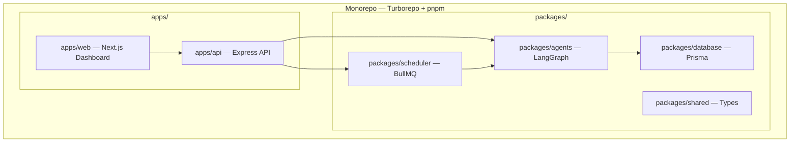

# Quinn Build Walkthrough

## What Was Built

Quinn is a complete, production-ready AI Chief Marketing Officer system for Dermaqea — a multi-agent orchestration platform with an executive dashboard.

---

## Architecture Summary

---

## Changes Made

### Phase 1: Monorepo Foundation
| File | Purpose |
|------|---------|
| [package.json](file:///home/ashley/projects/Quinn/package.json) | Root workspace with Turborepo scripts |
| [pnpm-workspace.yaml](file:///home/ashley/projects/Quinn/pnpm-workspace.yaml) | Workspace definition (apps/*, packages/*) |
| [turbo.json](file:///home/ashley/projects/Quinn/turbo.json) | Task pipeline with build deps & caching |
| [tsconfig.base.json](file:///home/ashley/projects/Quinn/tsconfig.base.json) | Shared TypeScript config (ESNext, strict) |
| [docker-compose.yml](file:///home/ashley/projects/Quinn/docker-compose.yml) | PostgreSQL 16 (pgvector) + Redis 7 |
| [.env.example](file:///home/ashley/projects/Quinn/.env.example) | All required environment variables |

---

### Phase 2: Database — 18 Models, 13 Enums
| File | Purpose |
|------|---------|
| [schema.prisma](file:///home/ashley/projects/Quinn/packages/database/prisma/schema.prisma) | Complete data model with pgvector |
| [client.ts](file:///home/ashley/projects/Quinn/packages/database/src/client.ts) | Singleton Prisma client |
| [seed.ts](file:///home/ashley/projects/Quinn/packages/database/src/seed.ts) | Dermaqea brand context + Q3 OKRs |

**Models**: Organization, Contact, Relationship, ContentItem, ContentCalendarEntry, Opportunity, Approval, QuarterlyGoal, KeyResult, Initiative, AnalyticsSnapshot, Briefing, MarketingAsset, Memory (pgvector), AgentLog, FounderPreference, Campaign

---

### Phase 3: Shared Types & Context
| File | Purpose |
|------|---------|
| [types.ts](file:///home/ashley/projects/Quinn/packages/shared/src/types.ts) | Decision framework, agent protocol, WebSocket events |
| [constants.ts](file:///home/ashley/projects/Quinn/packages/shared/src/constants.ts) | Dermaqea context, agent role descriptions |

---

### Phase 4: Agent System — 7 Agents on LangGraph
| File | Purpose |
|------|---------|
| [state.ts](file:///home/ashley/projects/Quinn/packages/agents/src/state.ts) | LangGraph shared state (messages, routing, reports) |
| [graph.ts](file:///home/ashley/projects/Quinn/packages/agents/src/graph.ts) | Main StateGraph with PostgresSaver checkpointing |
| [quinn.ts](file:///home/ashley/projects/Quinn/packages/agents/src/agents/quinn.ts) | CMO supervisor — strategic routing with structured output |
| [sage.ts](file:///home/ashley/projects/Quinn/packages/agents/src/agents/sage.ts) | Research intelligence agent |
| [nova.ts](file:///home/ashley/projects/Quinn/packages/agents/src/agents/nova.ts) | Content marketing agent |
| [atlas.ts](file:///home/ashley/projects/Quinn/packages/agents/src/agents/atlas.ts) | Growth & BD agent |
| [iris.ts](file:///home/ashley/projects/Quinn/packages/agents/src/agents/iris.ts) | CRM & relationship management agent |
| [helix.ts](file:///home/ashley/projects/Quinn/packages/agents/src/agents/helix.ts) | Presentation & assets agent |
| [beacon.ts](file:///home/ashley/projects/Quinn/packages/agents/src/agents/beacon.ts) | Analytics agent |
| [synthesize.ts](file:///home/ashley/projects/Quinn/packages/agents/src/agents/synthesize.ts) | Briefing synthesis node |
| [semantic.ts](file:///home/ashley/projects/Quinn/packages/agents/src/memory/semantic.ts) | pgvector semantic memory system |
| [database.ts](file:///home/ashley/projects/Quinn/packages/agents/src/tools/database.ts) | 10 LangChain tools for DB operations |
| [workflows/index.ts](file:///home/ashley/projects/Quinn/packages/agents/src/workflows/index.ts) | Daily briefing, weekly review, chat workflows |
| [system.ts](file:///home/ashley/projects/Quinn/packages/agents/src/prompts/system.ts) | System prompt builder with company context |

---

### Phase 5: Scheduler — BullMQ Cron Jobs
| File | Purpose |
|------|---------|
| [index.ts](file:///home/ashley/projects/Quinn/packages/scheduler/src/index.ts) | Daily/weekly/quarterly cron schedules + manual triggers |

---

### Phase 6: API Server — 15+ Endpoints
| File | Purpose |
|------|---------|
| [index.ts](file:///home/ashley/projects/Quinn/apps/api/src/index.ts) | Express REST + WebSocket server |

**Endpoints**: `/api/briefings`, `/api/approvals`, `/api/organizations`, `/api/content`, `/api/content/calendar`, `/api/opportunities`, `/api/relationships`, `/api/analytics`, `/api/goals`, `/api/quinn/chat`, `/api/quinn/trigger/:workflow`, `/api/logs`, `/api/health`, plus WebSocket at `/ws`

---

### Phase 7: Dashboard — 10 Pages
| Page | File |
|------|------|
| Command Center | [page.tsx](file:///home/ashley/projects/Quinn/apps/web/src/app/(dashboard)/page.tsx) |
| Approvals | [page.tsx](file:///home/ashley/projects/Quinn/apps/web/src/app/(dashboard)/approvals/page.tsx) |
| Research | [page.tsx](file:///home/ashley/projects/Quinn/apps/web/src/app/(dashboard)/research/page.tsx) |
| Content Hub | [page.tsx](file:///home/ashley/projects/Quinn/apps/web/src/app/(dashboard)/content/page.tsx) |
| Growth | [page.tsx](file:///home/ashley/projects/Quinn/apps/web/src/app/(dashboard)/growth/page.tsx) |
| CRM | [page.tsx](file:///home/ashley/projects/Quinn/apps/web/src/app/(dashboard)/relationships/page.tsx) |
| Analytics | [page.tsx](file:///home/ashley/projects/Quinn/apps/web/src/app/(dashboard)/analytics/page.tsx) |
| OKRs | [page.tsx](file:///home/ashley/projects/Quinn/apps/web/src/app/(dashboard)/goals/page.tsx) |
| Talk to Quinn | [page.tsx](file:///home/ashley/projects/Quinn/apps/web/src/app/(dashboard)/chat/page.tsx) |
| Settings | [page.tsx](file:///home/ashley/projects/Quinn/apps/web/src/app/(dashboard)/settings/page.tsx) |

**Design**: Custom dark-first oklch theme, glassmorphism cards, gradient text, glow effects, animated stat counters, collapsible sidebar with Quinn branding.

---

## Verification

| Check | Status |
|-------|--------|
| `pnpm install` | ✅ All dependencies resolved |
| `next build` (dashboard) | ✅ All 10 pages compile, 0 errors |
| Dashboard rendering | ✅ Verified in browser at localhost:3000 |

---

## Next Steps to Go Live

1. **Set up `.env`** — Copy `.env.example` → `.env` and add your `OPENAI_API_KEY`
2. **Start infrastructure** — `docker compose up -d` (PostgreSQL + Redis)
3. **Initialize database** — `pnpm db:generate && pnpm db:push && pnpm db:seed`
4. **Start API** — `cd apps/api && pnpm dev`
5. **Start dashboard** — `cd apps/web && pnpm dev`
6. **Trigger first briefing** — Click "Trigger Daily Briefing" on the Command Center or hit `POST /api/quinn/trigger/daily-briefing`
